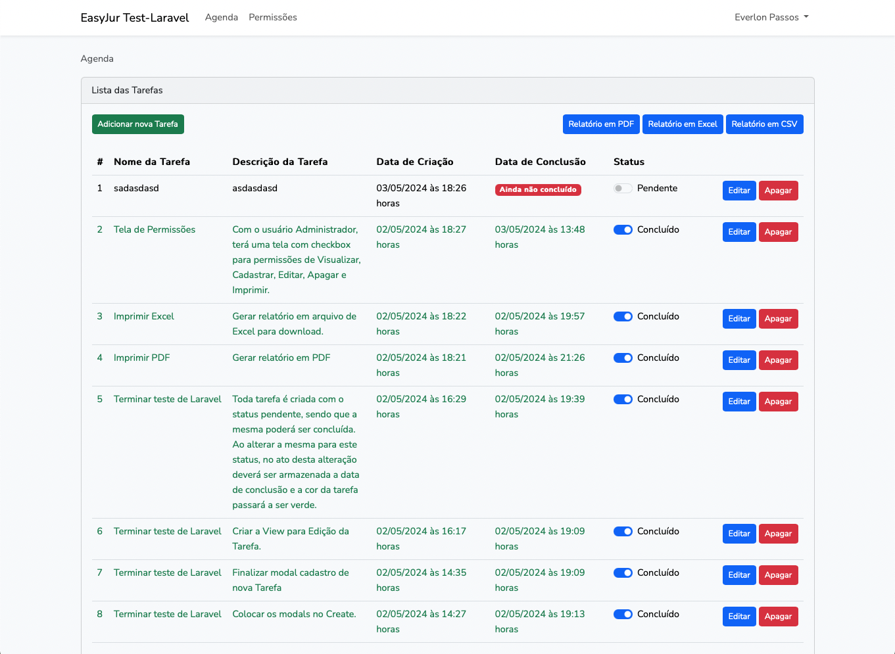
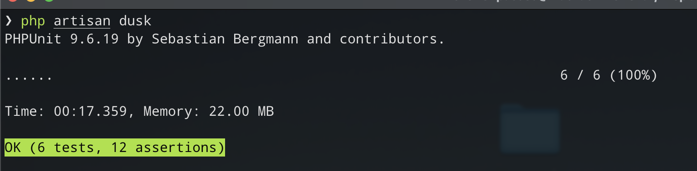

# EASYJUR Test-Laravel

Desenvolvendo uma Agenda de Tarefas em Laravel e comparando com o PHP sem framework.

## Instalação do Laravel e suas libs.

```
composer --prefer-dist create-project laravel/laravel <nome do projeto> "8.0"
composer require laravel/ui
"spatie/laravel-permission"
composer require maatwebsite/excel
composer require laravel/sail --dev
```

_Sail_ é necessário para rodar o _docker_ abaixo:

`docker-compose up -d`

## Screenshots



## Video explicativo

[Apresentação do Teste de Laravel](https://youtu.be/NPUUTbS1emA)

## Tests

Liberei duas linhas no _phpunit.xml_ para não sujar o MySQL. (ver Github)
Coloquei a porta do _Artisan Serve_ no _.env_ em _APP_URL_.

Executar _Artisan Cache_ para atualizar estas configurações.

`php artisan config:cache`

Criar um novo teste unitário:
`php artisan make:test CustomerTest --unit`

Para rodar os testes só executar:
`vendor/bin/phpunit`

Para executar somente um teste específico:
`vendor/bin/phpunit --filter test_only_logged_in_users_can_see_this_routes`

Para executar testes de navegadores é preciso instalar o _Dusk_:

`composer require --dev laravel/dusk`
`php artisan dusk:install`
`php artisan dusk:chrome-drive 114` Caso seja necessário baixar uma versão específica (última 114).

Tive problemas com versão do _chromedrive_ (2h30m para resolver).

Instalei o _Dusk-updater_ (https://github.com/staudenmeir/dusk-updater)

`composer require --dev staudenmeir/dusk-updater`
`php artisan dusk:chrome-drive` atualizei para versão 124 e resolvido para continuar.

`php artisan dusk`



### Obrigado!
